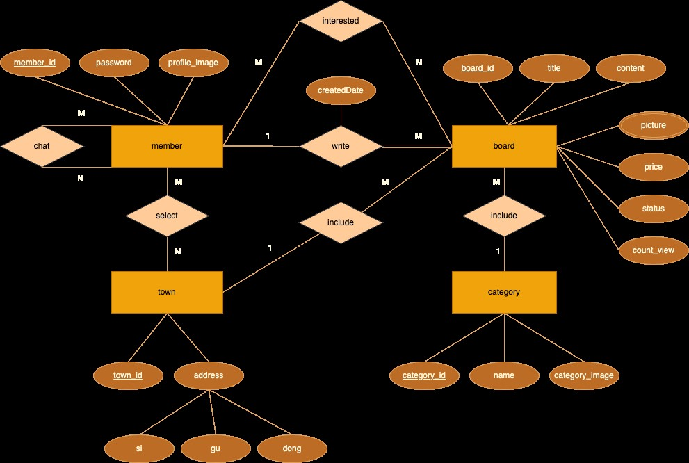
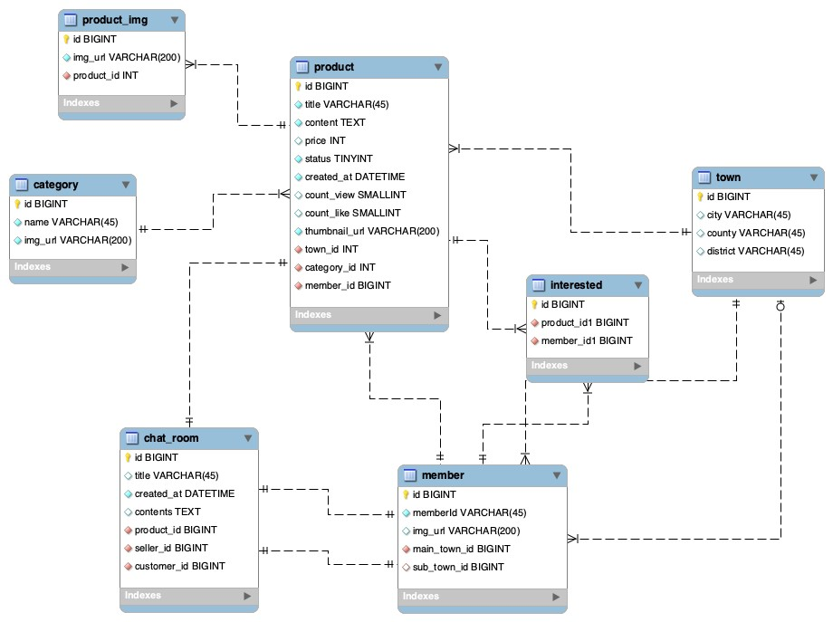
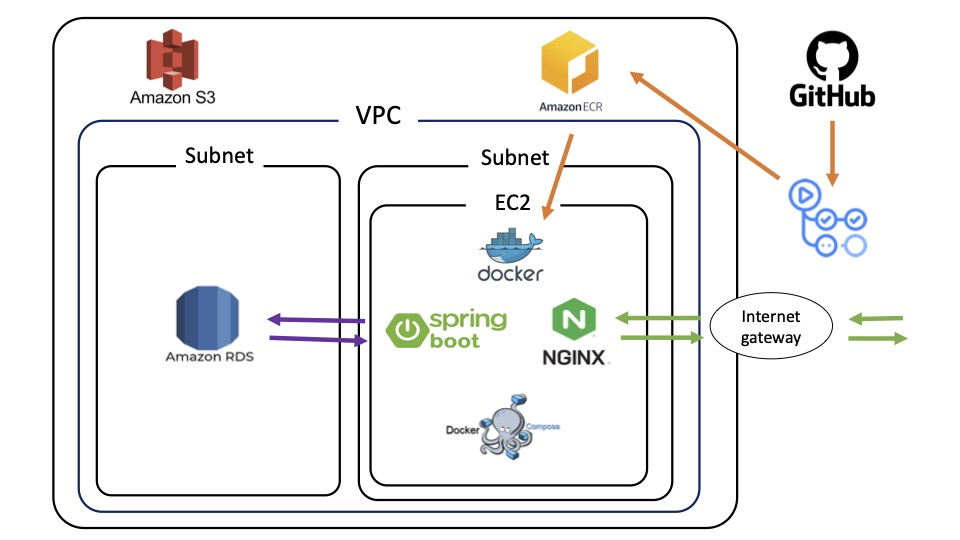

<p align="center"><a href="https://github.com/codesquad-members-2023-final/second-hand/wiki"><a/>

## 💡 소개

코드스쿼드 그룹 프로젝트, `second hand`입니다. `second hand`는 중고 거래 플랫폼 서비스입니다.
`secaond hand`는 당근마켓처럼 사용자가 등록한 동네를 기반으로 판매할 상품을 게시하고 채팅을 통하여 판매하는 웹 전용 애플리케이션입니다.


## 🔨 프로젝트 데모

## 메인 페이지


## 동네 설정 페이지


## 카테고리 페이지


## 상품 등록 및 상품 카테고리 페이지


## 판매 목록 페이지


## 관심 목록 페이지


## 🔨 프로젝트 주요 기능

- 카카오,깃허브 로그인을 통해 로그인할 수 있습니다.
- 현재 동네를 기준으로 등록된 상품을 볼 확인할 수 있습니다.
- 지원하는 동네에 한해서 유저의 동네를 변경할 수 있습니다.
- 상품을 카테고리 별로 확인할 수 있습니다.
- 각 상품의 상세정보를 확인할 수 있으며 좋아요를 눌러 찜할 수 있습니다.
- 사진과 함께 판매를 원하는 물품을 등록할 수 있습니다.
- 현재 유저가 판매중인 상품을 확인할 수 있습니다.
- 유저가 좋아요를 누른 상품을 확인할 수 있습니다.
- 상품에 대한 판매자와의 채팅을 할 수 있습니다.(리팩토링 후 구현 예정)

## 🧾 기술 스택(수정 예정)

### 공통


### Back-End

         
 


### Front-End

     


### iOS


## 프로젝트 구조
```
📦secondhand
 ┣ 📂config
 ┣ 📂domain
 ┃ ┣ 📂categoriy
 ┃ ┣ 📂chat
 ┃ ┣ 📂image
 ┃ ┣ 📂interested
 ┃ ┣ 📂login
 ┃ ┣ 📂member
 ┃ ┣ 📂memberToken
 ┃ ┣ 📂oauth
 ┃ ┣ 📂product
 ┃ ┗ 📂town
 ┣ 📂exception
 ┃ ┣ 📂ouath
 ┃ ┣ 📂token
 ┃ ┣ 📂v2
 ┣ 📂infrastructure
 ┃ ┣ 📂jwt
 ┣ 📂presentation
 ┃ ┣ 📂controller
 ┃ ┣ 📂filter
 ┃ ┣ 📂interceptor
 ┃ ┗ 📂support
 ┃ ┃ ┣ 📂converter
 ┣ 📂service
 ┣ 📂util
```
## 요구사항 및 다이어그램

[요구 사항](https://hill-mongoose-402.notion.site/d3016db5a3b54ae687677e26234cd3b2?pvs=4)




## 테스트 전략

- 개발자가 변경사항을 develop branch에 push할 경우 아래 3단계를 테스트합니다.
1. 단위 테스트: junit을 통해 단위 테스트합니다.
2. 통합 테스트 : 테스트 컨테이너를 활용해 실제 배포 환경과 같게 맞춘 후 API를 테스트 합니다.
3. 인수 테스트 : 테스트 컨테이너를 활용해 팀원들과의 공통 이해를 바탕으를 테스트 합니다.

## 애플리케이션 배포

```yaml
//로컬에서
./gradlew build //빌드 후

docker build -t secondhand/boards . //도커 이미지 빌드

docker login //도커 로그인

docker push secondhand/boards // 도커 push

//ec2
docker login

docker pull secondhand/boards

docker docker-compose up
```
## API 엔드포인트 목록 및 사용법

[API 명세서](https://hill-mongoose-402.notion.site/API-0576b87e6fa44d85a6427e1b4cebfadc?pvs=4)

## 👪 멤버 소개

|  |  |  |  |  |  |
| :-----------------------------------------------------------: | :------------------------------------------------------------: | :----------------------------------------------------------------: | :-----------------------------------------------------------: | :-----------------------------------------------------------: | :-----------------------------------------------------------: |
|        [**제이든(FE)**](https://github.com/JaydenLee1116)         |           [**훈딩(FE)**](https://github.com/hoongding)           |         [**코어(BE)**](https://github.com/meena2003)         |        [**감자(BE)**](https://github.com/leegyeongwhan)         |        [**에디(iOS)**](https://github.com/raindropiOS)         |        [**하림(iOS)**](https://github.com/harimrim)         |

## 참고자료

[기술 블로그](https://leegyeongwhan.github.io/)
